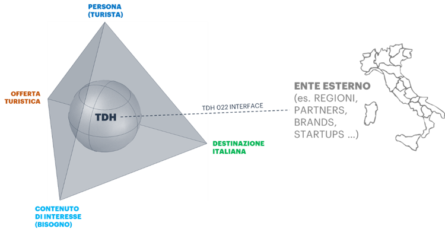

**1.1 Contesto di riferimento**
===============================

Il Piano Nazionale di Ripresa e Resilienza (PNRR) ha posto tra i propri
obiettivi il rilancio del settore economico del Turismo. Il Turismo in
Italia, infatti, costituisce un’importante fonte di vantaggio
competitivo per l’intero paese, rappresentando il 13% del PIL nel 2017
(Banca d’Italia) e contando oltre 500 mila imprese di filiera nel 2019
con oltre 1.9 milioni di addetti (ISTAT). I consumi connessi al turismo
nel 2018 sono stati circa 84 miliardi di euro (ISNART). I dati ISTAT
hanno registrato, pre-pandemia, arrivi - nazionali ed internazionali -
pari a circa 131 milioni e presenze intorno ai 436 milioni (ISTAT).

In particolare, nell’ambito della Misura 4. “Turismo 4.0”,
l’Investimento 4.1 – “Tourism Digital Hub” (TDH) è finalizzato a
realizzare una piattaforma web dedicata, che consenta il collegamento
dell'intero ecosistema turistico al fine di valorizzare, integrare e
favorire la propria offerta.

Gli obiettivi che si intende raggiungere tramite il TDH sono:

-  Incrementare i flussi, le destinazioni e la spesa, aumentando la
   qualità dell’offerta e relativa visibilità dei punti di interesse
   turistici in Italia (POI);

-  Valorizzare l’esistente framework di asset digitali - ad esempio i
   portali regionali - senza sovrapporsi, offrendo in aggiunta soluzioni
   per l’ottimizzazione dei costi;

-  Rafforzare il ruolo degli asset digitali del TDH, definendoli come
   veri e propri punti di riferimento istituzionali per la ricerca di
   informazioni inerenti ai POI rispetto ad una platea di turisti
   nazionali ed internazionali;

-  Coinvolgere l’intero sistema turistico italiano mediante un approccio
   open-source che raccolga input e generi output per tutti gli
   stakeholder;

-  Fidelizzare gli utenti (e quindi, potenziali turisti) attraverso
   proposte personalizzate rispetto alle loro esigenze e preferenze,
   offrendo un’esperienza sul portale personalizzata;

-  Favorire la nascita di una piattaforma che offra informazioni
   puntuali e corrette sui POI in Italia, e il cui dato vada a popolare
   piattaforme esterne per la localizzazione come Google My Business,
   Bing Places, Apple Maps e così via – andando quindi a portare un
   ulteriore beneficio in termini di visibilità sui più comuni motori di
   ricerca.

Il Ministero del Turismo, coadiuvato da ENIT - Agenzia nazionale per il
turismo, ha il compito di coordinare l’intero ecosistema turistico
italiano, promuovendo, in maniera unitaria, il rilancio del settore
turistico mediante un’offerta informativa e di servizi coesa ed
eterogenea, a fronte dei continui cambiamenti della domanda, nazionale
ed internazionale.

Obiettivo dell’iniziativa TDH è il rilancio di Italia.it, arricchito con
nuovi contenuti prodotti internamente e in collaborazione con le Regioni
e Province Autonome, ma anche attraverso integrazioni con partner in
ambito Turistico. Nel dettaglio, per ogni argomento trattato, il portale
presenterà contenuti dalla triplice valenza:

-  **Contenuto di Interesse**: **contenuto editoriale, la cui lettura
   consente al TDH di desumere l’interesse della Persona.** Consente di
   descrivere una o più destination, una o più offerte e/o qualsiasi
   tipo di evento riguardante l’esperienza turistica sul nostro
   territorio (es: un articolo editoriale che parla del Palio di Siena,
   se letto dal turista, fa desumere l’interesse per la città di Siena e
   per le rievocazioni storiche);

-  **Destinazione/Destination**: **attrazione sul territorio correlabile
   ad un punto di interesse** (coordinate x,y) **oppure ad un’area
   geografica («geometria») che permane nel medio-lungo termine** (es.
   Il Colosseo, la Fontana di Trevi, la città di Roma, ecc.);

-  **Offerta**: un oggetto turistico che può essere
   **consumato/prenotato/visitato a pagamento** (es: una camera
   d'albergo, un ingresso al museo).

Il TDH, inoltre, si pone l’obiettivo di far incontrare profittevolmente
la domanda turistica verso l’Italia con la relativa offerta italiana
(erogata da diversi attori), mettendo in relazione tra loro gli
interessi della persona (turista), le destinazioni e l’offerta prima,
durante e dopo l’esperienza turistica, creando valore per tutti gli
attori coinvolti.

All’interno del TDH è prevista la progettazione e implementazione di un
Piattaforma di Integrazione – Full Life Cycle API Manager che ha
l’obiettivo di supportare l’interoperabilità tra applicazioni e servizi
sia esterni che interni al TDH:

-  servizi esterni: dati di seconda parte (es. Regioni), dati di terza
   parte (es Enti Privati e Pubblici integrativi rispetto al sistema
   nazionale), dati geografici;

-  servizi interni: integrazione con applicazioni interne al TDH che
   coprono moduli specifici (es. CRM).

In un’ottica di raggiungimento dell’obiettivo di coinvolgimento
dell’intero sistema turistico italiano, la Piattaforma di Integrazione e
Api Manager garantisce il coordinamento informatico e informativo dei
dati tra le Amministrazioni (centrali, regionali e locali), gli Enti e
Società Terze con l’Ecosistema Digitale del TDH. Viene altresì
identificato un protocollo di comunicazione standard tra il TDH e il
mondo esterno, definito TDH022.

In tal senso, il TDH022 si pone come Standard Digitale a livello
Nazionale, preposto allo scambio di dati e contenuti sia “aperti” (open
data) che “chiusi” (private data) tra i partecipanti, svolgendo altresì
ruolo di interfaccia di integrazione tra il TDH e gli Operatori di
Settore che desiderano far parte dell’Ecosistema e che sono operativi
sul territorio nazionale italiano.

In *Figura 1 - Ecosistema TDH e connessione al mondo esterno mediante
TDH022* viene schematizzata la strategia del Tourism Digital Hub e di
interconnessione.

|image0|

*Figura 1 - Ecosistema TDH e connessione al mondo esterno mediante
TDH022*

Le modalità di interazione con l’Ecosistema TDH permettono sia di fruire
di servizi digitali disponibili al suo interno sia di
svilupparne/erogarne di nuovi (open o closed) mettendoli a disposizione
dei soggetti aderenti all’Ecosistema. In tal senso, le interazioni
prevedono che gli operatori (pubblici e privati) aderenti al TDH022
possano svolgere a seconda dei casi funzioni di:

-  erogatore di servizi, nel caso in cui mettano a disposizione del TDH
   servizi e funzionalità;

-  fruitore dei servizi, nel caso in cui utilizzino servizi digitali
   messi a disposizione da soggetti terzi all’interno dell’Ecosistema.

