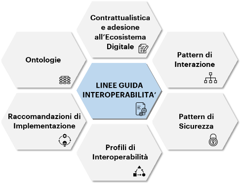

**2.1 Struttura del documento**
===============================

Le Linee Guida forniscono una visione di insieme generale e ad esse sono
collegati Documenti Operativi (DO) Figura 2 - *Struttura delle Linee
Guida e dei Documenti Operativi* - ai quali si rimanda per dettagli
relativi a standard tecnologici e loro modalità di utilizzo al fine di
fruire e/o erogare dati e/o servizi digitali per il tramite di sistemi
terzi verso e dal TDH:

+-----------------------------------+--------------------------------------------------------------------------------------------+
| **Documento Operativo 1**         | :download:`Pattern di interazione <../media/TDH022 Pattern di interazione.pdf>`            |
+-----------------------------------+--------------------------------------------------------------------------------------------+
| **Documento Operativo 2**         | Pattern di sicurezza                                                                       |
+-----------------------------------+--------------------------------------------------------------------------------------------+
| **Documento Operativo 3**         | Profili di interoperabilità                                                                |
+-----------------------------------+--------------------------------------------------------------------------------------------+
| **Documento Operativo 4**         | Raccomandazioni di                                                                         |
|                                   | implementazione                                                                            |
+-----------------------------------+--------------------------------------------------------------------------------------------+
| **Documento Operativo 5**         | Ontologie                                                                                  |
+-----------------------------------+--------------------------------------------------------------------------------------------+
| **Documento Operativo 6**         | Contrattualistica e adesione                                                               |
|                                   | all’Ecosistema Digitale                                                                    |
+-----------------------------------+--------------------------------------------------------------------------------------------+

Al fine di assicurare il costante allineamento alle evoluzioni
tecnologiche, l’aggiornamento dei DO è realizzato dagli operatori
preposti nelle more delle tempistiche e delle modalità da attuare.

|image0|

*Figura 2 - Struttura delle Linee Guida e dei Documenti Operativi*

