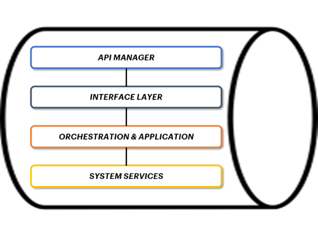

**4.1 Piattaforma applicativa**
===============================

Ai fini dell’interoperabilità con il Tourism Digital Hub agli Operatori
(ed es. Enti, Regioni) si raccomanda l’utilizzo di un applicativo che
permetta di gestire le API (invocare/esporre) e dia la possibilità di
consultarle e monitorarle garantendone la gestione operativa; tale
piattaforma, pertanto, dovrà essere dotata di:

-  **API Manager:** utile alla definizione di regole di accesso alle
   proprie API e alla gestione delle stesse;

-  **API Gateway:** strumento che gestisce le API, interponendosi tra un
   client e una serie di servizi di back-end; in sostanza un API Gateway
   funge da proxy inverso, accettando tutte le chiamate API, e laddove
   previste autorizzazioni e autenticazioni, ha il compito di accettare
   solo le chiamate autorizzate/autenticate. Si occupa inoltre di
   aggregare i vari servizi richiesti, restituendo un risultato
   appropriato;

-  **Integration Platform**: strumento che si occupa della mediazione
   tra i servizi per realizzare modelli “loose-coupled” [1]_ (a bassa
   dipendenza) tra provider e fruitori di servizi, grazie
   all’introduzione di un broker middleware che si occupi di fornire:

   -  conversioni di protocollo e di formato dei dati;

   -  policy nell’interazione provider-fruitori (es.: auditing, logging
      e security monitoring);

   -  logiche di invocazione e inoltro delle chiamate ai servizi
      (dispatching).

Si consiglia inoltre di prevedere la componente di **Orchestrazione**,
intesa come la composizione ed esecuzione coordinata di API che possono
essere organizzate in tre macrocategorie:

-  **Interface layer:** livello di pertinenza specifica del Gateway,
   dove sono realizzate le interfacce verso i client che consumano il
   servizio;

-  **Application & Orchestration Services**: livello dei servizi
   focalizzati sul dominio della service logic, orchestrazione dei
   processi di business e astratti dalle tematiche di enterprise
   integration a livello di back-end;

-  **System services**: servizi che operano a livello di integrazione
   delle singole applicazioni di back-end (ad es. Database, Host, Cloud
   SaaS).

In aggiunta a ciò, è necessario prevedere le funzioni di
**Monitoraggio** e **Alerting “end to end”** dei flussi di integrazione
delle API sviluppate ai fini dell’interoperabilità TDH022.

|image0|

*Figura 4 – Schema esplicativo della piattaforma applicativa di API
Gateway*

.. [1]
   Fonte: “Why is the Web Loosely Coopled? A Multi-Faceted Metric for
   Service Design” (Pautasso, Wilde – 2009) Riferimento online:
   http://www2009.eprints.org/92/1/p911.pdf

