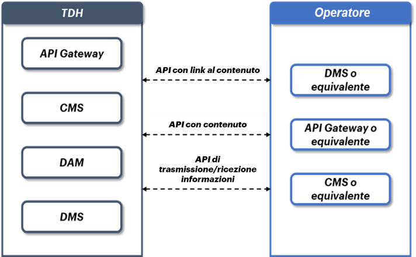

**4.2 Requisiti minimi per l’interconnessione al TDH lato Operatori (Regioni, Enti, Soggetti Terzi)**
=====================================================================================================

A fronte della necessità di stabilire una connessione tra Operatori e
TDH si consiglia, ai soggetti che volessero interconnettersi ad esso, di
dotarsi di un’infrastruttura tecnologica che permetta loro di
scambiare/ricevere informazioni e contenuti, utilizzando una modalità
criptata, autenticata e autorizzata.

In particolare, per le Regioni si prevede la condivisione e/o
trasmissione di contenuti digitali (articoli, immagini, video ecc…) e di
informazioni riferiti a POI (Punti di Interesse), Destinazioni,
Interessi ed Offerte. Pertanto, si raccomanda alle Regioni, qualora già
non lo fossero, di dotarsi di strumenti specifici in grado di gestire la
memorizzazione e, quando necessario, la trasmissione dei suddetti
contenuti (es. CMS).

In generale è auspicabile che gli Operatori interessati
all’interconnessione con il TDH abbiano gli strumenti applicativi
adeguati all’interscambio bidirezionale delle informazioni con relativo
aggiornamento real time ove possibile.

Si rende dunque possibile effettuare la connessione bidirezionale
TDH/Operatore a mezzo API mediante:

-  **API con link al contenuto**: ai fini della fruizione di contenuti
   digitali condivisi dagli operatori quali immagini, video, articoli,
   ecc… verranno esposte API con link per richiamare la risorsa
   (contenuto) presente all’interno del CMS dell’Operatore e che viene
   presentata dal TDH;

-  **API con contenuto**: ai fini della fruizione diretta di contenuti
   digitali condivisi dagli operatori sopra riportati che vengono
   trasmessi direttamente all’utente finale dal DMS;

-  **API di trasmissione e/o ricezione informazioni:** ai fini
   dell’interscambio di informazioni tra TDH e Regioni/Operatori.

|image0|

*Figura 5 – Schema esplicativo dell’interconnessione TDH/Regioni a mezzo
differenti API*

.. _section-16:

.. _section-17:

.. _section-18:

.. _section-19:

.. _section-20:

.. _section-21:

.. _section-22:

.. _section-23:

.. _section-24:

.. _section-25:

.. _section-26:

