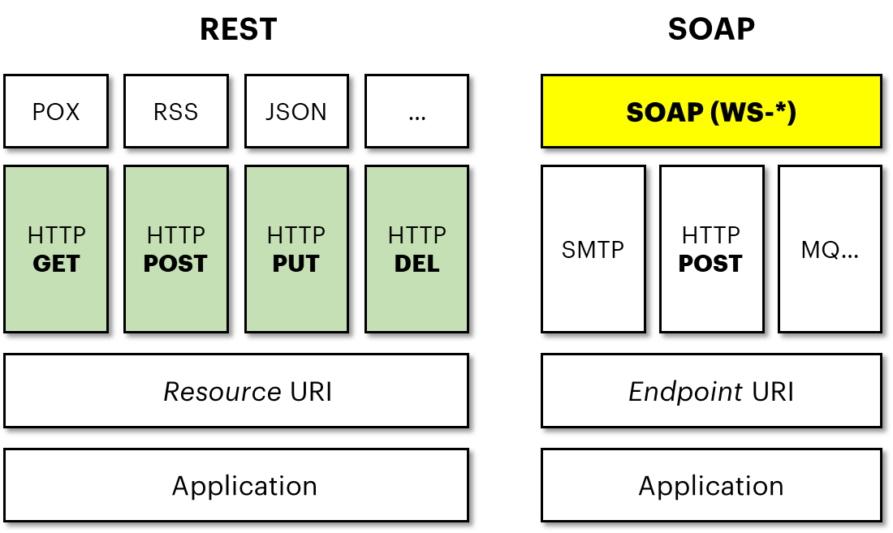

**5.2 API web RESTful** **(Representational State Transfer)**
=============================================================

Prima di presentare nello specifico le API Web RESTful, si rende
necessario un approfondimento preliminare in merito a “REST”; nello
specifico, REST non è un protocollo, ma uno stile architetturale, ossia
rappresenta un’astrazione dei componenti di un’architettura all’interno
di un sistema *hypermedia* distribuito. I principi fondamentali di
questo stile architetturale sono:

-  **Client-Server** (viene usato il paradigma **separation of concerns
   (SoC)**)\ **:** a livello di progettazione ogni sistema deve essere
   concepito come un modulo avente un compito determinato; in sostanza,
   un Client può solo invocare un’API messa a disposizione da un Server
   che si occupa di eseguire l’attività richiesta, o di respingerla,
   restituendo un messaggio di risposta al Client. La gestione di
   eccezioni/ripubblicazioni è delegata al client;

-  **Stateless**: la comunicazione tra un Client ed un Server deve
   essere senza stato tra le richieste; ciò significa che ogni richiesta
   che parte dal Client dovrà avere il set di informazioni necessarie
   per consentire al Server di comprendere la richiesta. Per cui tutti i
   dati necessari vengono restituiti al client alla fine di ciascuna
   richiesta;

-  **Chacheable**: in questo tipo di architettura esiste il concetto di
   “vincolo di cache” ossia l’obbligo di etichettare le risposte come
   “\ *cacheable”* o meno. Questo permette ad uno degli attori che si
   interpongono tra Client (compreso) e Server di memorizzare la
   risposta nella cache, e migliorare così le performance di rete;

-  **Uniform Interface**: al fine di avere una strategia di caching
   efficiente in una rete, esiste il concetto di “vincolo di uniformità
   dell’interfaccia di accesso ai dati” ossia l’obbligo che i componenti
   coinvolti nella comunicazione utilizzino un’interfaccia uniforme;
   tale vincolo ha alcune declinazioni, quali il concetto di “risorsa”:
   ogni informazione è rappresentata, pertanto, come "risorsa". Per
   quanto una risorsa possa cambiare nel tempo, la semantica della sua
   mappatura deve restare costante: in sostanza una risorsa deve essere
   identificata univocamente (URI) nel tempo. Altra caratteristica è
   come la risorsa può essere rappresentata in modi diversi (JSON,
   GeoJSON, XML, JPG) e ciò è reso possibile attraverso la definizione
   di dati, metadati e dati di controllo. I dati di controllo possono
   definire lo scopo di un messaggio, ad esempio come gestire la cache
   di una risposta. Ultima declinazione è quello relativo al
   collegamento tra risorse secondo il principio *HATEOS* (hypermedia As
   The Engine Of Application State);

-  **Layered System**: Il principio in questione prevede che
   un'architettura REST sia rappresentata attraverso più livelli
   architetturali, indipendenti l'uno dall'altro, con degli scopi
   specifici (Es. sicurezza, balancing, ...);

-  **Code on demand (opzionale)**: Un'implementazione basata su REST può
   estendere le funzionalità del client, eseguendo il codice (es. script
   o applet).

Le API web RESTful ricalcano i principi esposti e sono basate su
protocollo HTTP, da cui ne ereditano tutte le proprietà, come ad esempio
il formato del dato trasportato, definito dal “content-type”, o i codici
di errore restituiti dal server (es. 400, 500), e dai metodi (es. Get
per recuperare dati, Post per creare risorse, Delete per cancellare
risorse, …).

|image0|

*Figura 6 - REST e SOAP a confronto*

