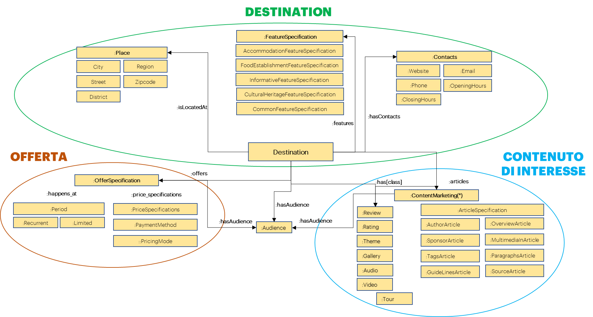

**6.3 Il processo di sviluppo delle ontologie**
===============================================

*6.3.1 La costruzione delle ontologie*
--------------------------------------

È importante definire un processo di creazione delle ontologie per
assicurare accuratezza, coerenza tra domini, usabilità e la possibilità
di incorporarle in un'unica ontologia in una fase successiva.

Lo sviluppo di un’ontologia si articola principalmente in cinque fasi:

1. **Valutazione degli standard:** stabilire standard a livello
   organizzativo e leggibili dalle macchine per la descrizione, i
   concetti e il contesto di dati. Questa fase comprende la ricerca di
   ontologie/knowledge graph esistenti all’interno e all’esterno
   dell’organizzazione, realizzando workshop strategici con esperti del
   settore. In seguito, si procede alla raccolta delle best-practice,
   materiali e documenti ontologici disponibili.

2. **Definizione dell'ontologia:** in questa fase viene definita la
   semantica dei vocabolari di ogni dominio, le classi le relazioni e le
   proprietà di ciascun dominio.

3. **Costruzione dell'ontologia:** si procede alla costruzione e
   l’unione delle ontologie stesse, utilizzando le caratteristiche
   ontologiche individuate, per poi andare a costruire un modello
   ontologico di livello superiore collegando i domini selezionati. In
   questa fase è inoltre necessario creare un catalogo per la mappatura
   dei dati dell’origine ontologica.

4. **Istanziamento dell’ontologia:** una volta creata, si procede a
   configurare i sistemi per accogliere il modello del dato, le sorgenti
   di dati esterne e il vocabolario per poi andare a distribuire
   l’ontologia istanziata in un graph database.

5. **Validazione dell’ontologia**: in questa fase vengono eseguite delle
   query su un’interfaccia API per convalidare i requisiti organizzativi
   e di analisi del dato da scambiare.

*6.3.2 La rappresentazione delle ontologie per il Turismo*
----------------------------------------------------------

Un'ontologia è un insieme di asserzioni ed ogni asserzione è
rappresentata sotto forma di tripla con un soggetto, un predicato, e un
oggetto. Quindi, un'ontologia è rappresentata come un insieme di triple,
i cui elementi sono di seguito esplicati:

1. **Soggetto:** Il soggetto di una tripla è una persona, una cosa o un
   concetto astratto su cui si dice qualcosa – es. “Il turista”;

2. **Predicato:** Il predicato di una tripla consente di creare una
   relazione tra il soggetto e l’oggetto – es. “desidera visitare”;

3. **Oggetto:** L'oggetto della tripla è qualsiasi persona, cosa o
   soggetto astratto collegabile o riconducibile al soggetto tramite il
   predicato – es. “la Fontana di Trevi”.

All’interno delle ontologie ogni predicato viene indicato/definito come
“proprietà” (object property) ed è espresso attraverso il linguaggio
RDF/OWL – Ontology Web Language (OWL), ovvero il “linguaggio di
markup per rappresentare esplicitamente il significato e la
semantica dei termini tramite vocabolari e le relazioni intercorrenti
tra gli stessi termini presi in esame” [1]_.

Altro concetto importante è rappresentato dalle “Classi di
un’ontologia”; per il settore Turistico, le classi sono la descrizione
formale esplicita di concetti (possono contenere termini come “hotel” o
“museo”). Un'ontologia per il dominio dei viaggi potrebbe contenere
concetti quali "destinazione turistica" e "mezzo di trasporto" e
relazioni tra esse. Solitamente le istanze vengono utilizzate per
modellare gli elementi che appartengono alle classi; ad esempio,
l'istanza “Duomo Milano” appartiene alla classe “Destinazione”.

Le classi sono generalmente organizzate in una gerarchia di sottoclassi,
mentre un'ontologia collegata ad un insieme di istanze individuali
costituisce una base di conoscenza.

Le proprietà stabiliscono invece le relazioni tra i concetti di
un'ontologia: ad esempio, la proprietà “isLocatedAt” associa un oggetto
al luogo cui appartiene. Il tipo più semplice di ontologie è chiamato
tassonomie e sono costituite da una gerarchia di classi che
rappresentano i concetti rilevanti nel dominio.

Definiti questi concetti preliminari, ai fini della rappresentazione di
un’ontologia è necessario seguire un determinato processo logico, di
sotto riportato:

1. Definizione delle classi – es: “appartamento”;

2. Disposizione delle classi in una gerarchia tassonomica
   (sottoclasse-superclasse) – es: “appartamento che fa parte di un
   condominio”;

3. Definizione delle proprietà delle classi – es: “appartamento ha un
   indirizzo”;

4. Descrizione dei valori consentiti nell’inserimento delle istanze –
   es: il civico dell’indirizzo è un “numero”.

Per l’approccio metodologico seguito lato TDH022 si rimanda al paragrafo
successivo.

*6.3.3 Approccio metodologico*
------------------------------

L’approccio metodologico utilizzato per lo sviluppo dello standard
ontologico per l’interoperabilità TDH022 si è basato sulle ontologie
esistenti [2]_ e di quelle presenti in letteratura applicabili al
dominio del Turismo.

Ai fini della definizione delle ontologie lato TDH ci si è avvalsi di
Ontopia, ovvero il “repository ufficiale delle ontologie e dei
vocabolari controllati sviluppati nell'ambito delle azioni previste dal
piano triennale per l'informatica della Pubblica Amministrazione e a
supporto del lavoro da svolgere per l'elenco delle basi di dati chiave e
il paniere dinamico” [3]_ ad oggi utilizzato quale base condivisa
all’interno del panorama informatico amministrativo italiano. Altro
repository ontologico utilizzato ai fini della definizione delle
ontologie è stato DATAtourisme, che struttura i dati che descrivono
tutti i punti di interesse turistico identificati dagli uffici del
turismo, dalle agenzie dipartimentali e dai comitati turistici regionali
sul territorio francese.

|image0|

*Figura 7 - Approccio metodologico utilizzato*

L’approccio metodologico ha portato al Framework per la definizione
delle ontologie in ambito turistico al fine di esplicitare i vari domini
e le relazioni intercorrenti tra essi.

|image1|

*Figura 8 – Ontologia Turistica TDH (illustrativa)*

Nella Figura 8 - *Ontologia Turistica TDH (illustrativa)* si evince che
il concetto centrale dell'ontologia è la tripla che mette in relazione
le classi «Contenuto di Interesse-Destination-Offerta», esplicate nel
dettaglio di seguito:

-  **Contenuto di Interesse**: **contenuto editoriale, la cui lettura
   consente al TDH di desumere l’interesse della Persona.** Consente di
   descrivere una o più destination, una o più offerte e/o qualsiasi
   tipo di evento riguardante l’esperienza turistica sul nostro
   territorio (es: un articolo editoriale che parla del Palio di Siena,
   se letto dal turista, fa desumere l’interesse per la città di Siena e
   per le rievocazioni storiche);

-  **Destinazione/Destination**: **attrazione sul territorio correlabile
   ad un punto di interesse** (coordinate x,y) **oppure ad un’area
   geografica («geometria») che permane nel medio-lungo termine** (es.
   Il Colosseo, la Fontana di Trevi, la città di Roma, ecc.);

-  **Offerta**: un oggetto turistico che può essere
   **consumato/prenotato/visitato a pagamento** (es: una camera
   d'albergo, un ingresso al museo).

Sulla base di tale relazione tra le classi appena esplicitata, è
possibile ipotizzare diversi schemi di interrelazione, osservabili di
seguito.

|image2|

*Figura 9 – Relazione Contenuto di Interesse – Offerta – Destination*

Nella figura 9 – *Relazione Contenuto di Interesse – Offerta –
Destination*, è possibile osservare come, a partire da un Contenuto di
Interesse (nel nostro caso un articolo editoriale presente sui portali
regionali che consente al TDH di desumere “gli interessi della Persona”)
sia possibile implementare un’Offerta collegata a diverse Destination;
per chiarezza si esplicita tale relazione a mezzo prossimi esempi:

-  **Contenuto di Interesse:** I concerti della famosa rockstar in
   Italia

-  **Offerta:** i biglietti per il concerto

-  **Destination:** lo stadio o il palazzetto dove si svolgerà il
   concerto [4]_

La risultante di questa interrelazione, nello specifico, potrà essere
declinata come: “Il concerto della famosa rockstar a Milano (Stadio San
Siro) il 1 Febbraio 2022 ore 21:30 (prezzo 70,00€)”, così come “Il
concerto della famosa rockstar a Modena (Stadio Braglia) il 10 Febbraio
2022 ore 21:00 (prezzo 65,00€)”.

|image3|

*Figura 10 – Relazione Contenuto di Interesse – Destination – Offerta*

Alla figura 10 – *Relazione Contenuto di Interesse – Destination –
Offerta* invece, viene data evidenza di come, a partire dall’articolo
editoriale (Contenuto di Interesse) sia possibile, sulla base di un
interesse per una determinata Destination, strutturare un’Offerta ad
hoc; di seguito esplicazione di quanto detto:

-  **Contenuto di Interesse:** Le bellezze del Parco Nazionale della
   Sila

-  **Destination:** Il Parco Nazionale della Sila

-  **Offerta:** Il biglietto di accesso al Parco Nazionale della Sila

La risultante di questa interrelazione in questo caso potrà essere
declinata come: “Visita del Parco Nazionale della Sila presso il Parco
Nazionale della Sila il 23 gennaio 2022 ore 9:00”.

|image4|

*Figura 11 – Relazione Contenuto di Interesse – Offerta*

In ultimo, alla Figura 11 – *Relazione Contenuto di Interesse – Offerta*
viene data evidenza di una casistica particolare, ovvero quella di un
Contenuto di Interesse su cui strutturare un’Offerta che non necessita
di una Destination a supporto, nello specifico si pensi alla casistica
delle guide enogastronomiche.

Di seguito esplicazione di quanto detto:

-  **Contenuto di Interesse:** Le migliori guide enogastronomiche del
   2022

-  **Offerta:** Guida dei Ristoranti d’Italia del 2022

La risultante di questa interrelazione in questo caso potrà essere
declinata come: “Guida dei Ristoranti d’Italia del 2022 (prezzo
22,00€)”.

Si rimanda al Documento Operativo di dettaglio per la definizione dei
vari attributi relativi ai Contenuti di Interesse, alle Destination e
alle Offerte.

.. [1]
   OWL Web Ontology Language Semantics and Abstract Syntax Section 2.
   Abstract Syntax (Patel-Schneider, Horrocks – 2004) – Riferimento
   online:
   https://www.w3.org/TR/2004/REC-owl-semantics-20040210/syntax.html

.. [2]
   Fonti per la definizione dell’ontologia TDH:

   Repository delle ontologie e dei vocabolari - piano triennale per
   l'informatica della PA e vocabolari controllati:
   https://github.com/italia/daf-ontologie-vocabolari-controllati/tree/master/Ontologie

   DATAtourisme data schema: https://framagit.org/datatourisme/ontology/

.. [3]
   Riferimento online:
   https://github.com/italia/daf-ontologie-vocabolari-controllati

.. [4]

   Si ricorda in tal senso che un concerto non è una Destination, in
   quanto non si riferisce ad un’attrazione sul territorio correlabile
   ad un punto di interesse o un’area geografica che permane nel
   medio-lungo termine.

.. |image3| image:: ../media/image11.png
   :width: 5.79375in
   :height: 1.17361in

